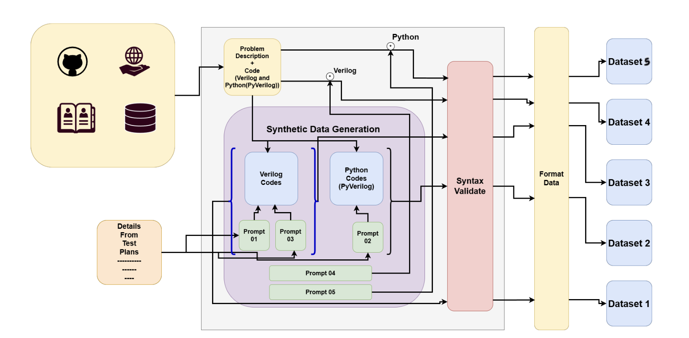
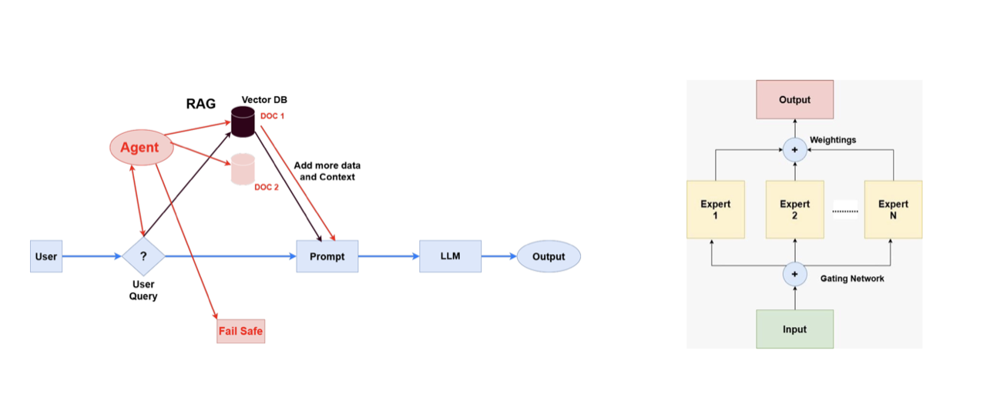

# Verilog Code Generation with Variations Using Fine-Tuned Large Language Models

## Table of Contents
1. [Abstract](#abstract)
2. [Related Works](#related-works)
3. [Methodology](#methodology)
4. [Experiment Setup and Implementation](#experiment-setup-and-implementation)
5. [Results and Analysis](#results-and-analysis)
6. [Conclusion](#conclusion)
7. [Team](#team)
8. [Supervisors](#supervisors)
9. [Acknowledgments](#acknowledgments)
10. [Publications](#publications)
11. [Links](#links)

---

## Abstract
The increasing complexity of modern hardware systems demands efficient and automated verification processes to ensure functional correctness in hardware design. Traditional Verilog test case generation is manual, time-consuming, and error-prone, necessitating advanced automation techniques. This project leverages Large Language Models (LLMs) to automate the generation of Verilog code variations, enhancing hardware design verification. We explore three structured approaches: (1) PyVerilog-based transformations using Python as an intermediate representation, (2) direct Verilog transformations for native code modifications, and (3) X-Form-based transformations generating Python scripts for structured variations. The project involves evaluating open-source LLMs (e.g., GPT, CodeGen, DeepSeek), constructing specialized datasets, fine-tuning models using techniques like Parameter-Efficient Fine-Tuning (PEFT), Agentic Retrieval-Augmented Generation (RAG), and Mixture of Experts (MoE), and validating outputs with industry-standard tools like VCS and SpyGlass. If initial models fail to produce syntactically and functionally correct variations, we will fine-tune LLMs for Verilog and PyVerilog code generation from natural language descriptions. The final deliverable is a fine-tuned LLM system that automates Verilog variation generation, significantly reducing manual effort and improving efficiency in Electronic Design Automation (EDA) workflows.

## Related Works
The complexity of modern hardware designs has escalated the need for automated verification processes. Existing systems for generating Verilog test case variations, such as those used by Synopsys and Cadence, rely heavily on manual intervention, leading to inefficiencies and potential errors. Recent advancements in LLMs, such as GPT, CodeGen, and DeepSeek, have shown promise in generating high-level programming languages like Python and C++. However, their application to hardware description languages (HDLs) like Verilog and VHDL is limited due to the unique syntax and semantics of HDLs. Research efforts, such as *VerilogEval* and *RTL-Bench*, have improved Verilog code generation from natural language, but generating diverse and functionally correct variations remains underexplored. Tools like PyVerilog and Verilator have facilitated HDL manipulation, yet automated variation generation for comprehensive test coverage is a critical gap this project addresses. Our work builds on these foundations by leveraging LLMs and structured transformation techniques to automate Verilog variation generation.

## Methodology
Our methodology automates Verilog code variation generation through a pipeline of model evaluation, dataset construction, preprocessing, fine-tuning, and validation. The process is designed to identify the most effective approach among PyVerilog-based, direct Verilog, and X-Form-based transformations.

### 1. Model Evaluation
We benchmark open-source LLMs (e.g., GPT, CodeGen, DeepSeek) to assess their ability to generate syntactically and functionally correct Verilog code and variations. Metrics include *Pass@k*, test case pass rate, and hardware compatibility, using benchmarks like *VerilogEval* and *HumanEval*.

### 2. Dataset Construction

We construct five specialized datasets:
- **Dataset 1**: Verilog base code + variation description → varied Verilog code.
- **Dataset 2**: PyVerilog base code + variation description → varied Python implementation.
- **Dataset 3**: Verilog base code + variation description → X-Form function (Python).
- **Dataset 4**: Hardware description → Verilog code.
- **Dataset 5**: Hardware description → PyVerilog implementation.

Data is sourced from GitHub (using Google BigQuery) and textbooks (using PyMuPDF), with curation to ensure quality and diversity.

### 3. Data Preprocessing
Preprocessing involves two stages:
- **Stage 1**: Syntax validation (VCS, SpyGlass), duplicate removal (MinHash, Jaccard similarity), and tokenization/parsing.
- **Stage 2**: Aligning base codes with variations and formatting for LLM fine-tuning.

### 4. Model Adaptation Approaches

#### a) PyVerilog-Based Adaptation
- Uses Python as an intermediate representation, with Verilog generated via PyVerilog.
- Fine-tuning methods: LoRA, QLoRA, Adapters (PEFT), Agentic RAG, and MoE.
- Validates outputs using VCS and SpyGlass.

#### b) Direct Verilog-Based Adaptation
- Directly fine-tunes LLMs on Verilog code and variations.
- Employs MoE architecture for structural/functional variation specialization.
- Uses PEFT, RAG, and MoE for fine-tuning.
- Addresses low data volume with augmentation (mutation, combination, randomization).

#### c) X-Form-Based Adaptation
- Trains LLMs to generate Python-based X-Form transformation functions.
- Applies X-Forms to base Verilog code to produce variations.
- Uses PEFT, RAG, and MoE for fine-tuning.
- Validates syntax and logic using VCS and SpyGlass.

### 5. Model Evaluation
Models are evaluated using:
- **Benchmarks**: *VerilogEval* (Verilog-specific), *HumanEval* (Python code generation).
- **Metrics**: *Pass@k*, test case pass rate, hardware compatibility, and diversity of variations.
- **Tools**: VCS, SpyGlass, and Verilator for functional and syntactic validation.

## Experiment Setup and Implementation
### Hardware Requirements
- **CPU**: Multi-core processor (e.g., Intel i7 or equivalent).
- **GPU**: NVIDIA GPU with CUDA support (e.g., RTX 3080 or higher) for LLM fine-tuning.
- **RAM**: Minimum 32 GB.
- **Storage**: 500 GB SSD for datasets and model checkpoints.

### Software Requirements
- **OS**: Linux (Ubuntu 20.04+ recommended) or WSL2 on Windows.
- **Python**: 3.8+.
- **Libraries**: `pymupdf`, `pyverilog`, `numpy`, `pandas`, `transformers`, `torch`.
- **EDA Tools**: Verilator (v4.0+), VCS, VCS SpyGlass (Synopsys license required).
- **Google BigQuery**: Google Cloud account with BigQuery API enabled.

### Implementation Steps
1. **Environment Setup**:
   - Install dependencies (see [Setup Instructions](#setup-instructions)).
   - Configure Google Cloud credentials for BigQuery access.
2. **Data Extraction**:
   - Run `scripts/extract_github.py` for GitHub data and `scripts/extract_textbooks.py` for textbook data.
   - Curate data using `scripts/curate_data.py`.
3. **Model Fine-Tuning**:
   - Configure LLMs in `models/` (e.g., GPT, CodeGen, DeepSeek).
   - Run fine-tuning scripts: `scripts/train_pyverilog.py`, `scripts/train_verilog.py`, `scripts/train_xform.py`.
4. **Testing**:
   - Validate outputs using `vcs -f <file.v>` and Verilator (`verilator --lint-only <file.v>`).
   - Convert PyVerilog to Verilog with `scripts/convert_pyverilog.py`.
5. **Evaluation**:
   - Generate reports using `scripts/evaluate_models.py`.

## Results and Analysis
This section will be updated as implementation progresses. Planned analyses include:
- **Quantitative Metrics**: *Pass@k*, test case pass rate, variation diversity (measured via code entropy), and hardware compatibility.
- **Qualitative Analysis**: Manual inspection of generated variations for functional correctness and design relevance.
- **Visualizations**: Bar charts for model performance, heatmaps for variation diversity, and error rate plots.
- **Comparative Study**: Performance comparison across PyVerilog, direct Verilog, and X-Form approaches.

## Conclusion
This section will be updated upon project completion. Expected outcomes include:
- A fine-tuned LLM capable of generating syntactically and functionally correct Verilog variations.
- Identification of the most effective approach (PyVerilog, direct Verilog, or X-Form).
- Recommendations for integrating the system into EDA workflows.
- Future work: Expanding dataset size, supporting additional HDLs (e.g., VHDL), and integrating with commercial EDA tools.

## Team
| Name                 | ID       | Email                                    |
|----------------------|----------|------------------------------------------|
| Sahan Nimantha       | E/19/205 | [e19205@eng.pdn.ac.lk](mailto:e19205@eng.pdn.ac.lk) |
| Jaliya Kumarasiri    | E/19/210 | [e19210@eng.pdn.ac.lk](mailto:e19210@eng.pdn.ac.lk) |
| Vidura Yashan        | E/19/455 | [e19455@eng.pdn.ac.lk](mailto:e19455@eng.pdn.ac.lk) |

## Supervisors
| Name                 | Email                                    |
|----------------------|------------------------------------------|
| Dr. Isuru Nawinne   | [isurunawinne@eng.pdn.ac.lk](mailto:isurunawinne@eng.pdn.ac.lk) |
| Prof. Roshan G. Ragel| [roshanr@eng.pdn.ac.lk](mailto:roshanr@eng.pdn.ac.lk) |
| Dr. Damayanthi Herath| [damayanthiherath@eng.pdn.ac.lk](mailto:damayanthiherath@eng.pdn.ac.lk) |

## Acknowledgments
- Synopsys Sri Lanka for project sponsorship and access to VCS/SpyGlass.
- Supervisors for their guidance and technical expertise.
- Open-source communities for tools like Verilator, PyVerilog, Hugging Face Transformers, and LLMs (GPT, CodeGen, DeepSeek).
- University of Peradeniya for academic support.

## Publications
This section will be updated as publications are finalized. Expected deliverables include:
<!-- 1. [Semester 7 Report](./docs/sem7_report.pdf) -->
<!-- 2. [Semester 7 Slides](./docs/sem7_slides.pdf) -->
<!-- 3. [Semester 8 Report](./docs/sem8_report.pdf) -->
<!-- 4. [Semester 8 Slides](./docs/sem8_slides.pdf) -->
<!-- 5. Nimantha, S., Kumarasiri, J., Yashan, V. "Automating Verilog Variation Generation with Fine-Tuned LLMs" (2025). [PDF](./docs/paper.pdf) -->

## Links
- [Project Repository](https://github.com/cepdnaclk/e19-4yp-Verilog-Code-Generation-With-Variations-Fine-Tuned-Large-Languag-Models)
- [Project Page](https://cepdnaclk.github.io/e19-4yp-Verilog-Code-Generation-With-Variations-Fine-Tuned-Large-Languag-Models/)
- [Department of Computer Engineering](http://www.ce.pdn.ac.lk/)
- [University of Peradeniya](https://eng.pdn.ac.lk/)
